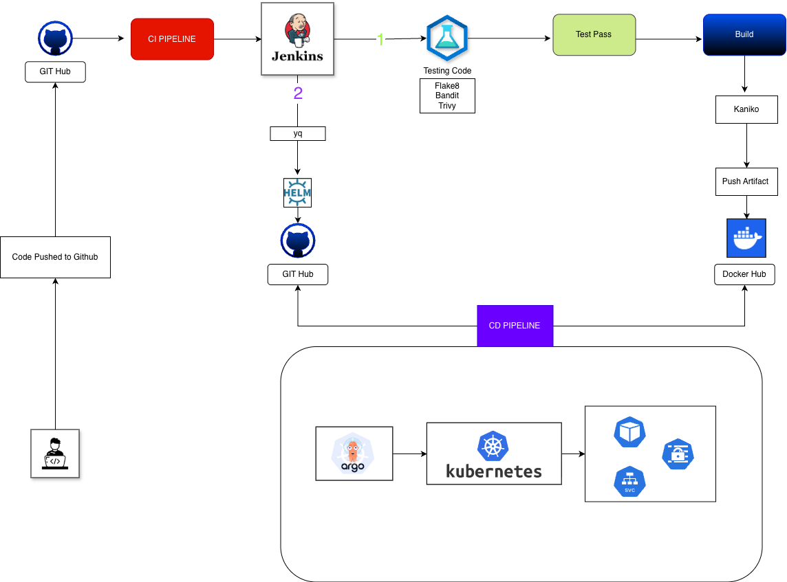

# HA-GitOps: AWS Resource Monitor

A Flask-based web application for monitoring AWS resources (EC2 instances, VPCs, Load Balancers, and AMIs) with a complete GitOps CI/CD pipeline using Jenkins, Docker, Kubernetes, Helm, and ArgoCD.

## 📋 Table of Contents

- [Overview](#overview)
- [Features](#features)
- [Architecture](#architecture)
- [Prerequisites](#prerequisites)
- [Quick Start](#quick-start)
- [CI/CD Pipeline](#cicd-pipeline)
- [Deployment](#deployment)
- [Project Structure](#project-structure)
- [Configuration](#configuration)
- [Troubleshooting](#troubleshooting)
- [Contributing](#contributing)

## 🎯 Overview

This project demonstrates a complete **End-to-End DevOps and GitOps workflow**. It features a Flask web application that monitors AWS resources, which is containerized with Docker, deployed to Kubernetes using Helm, and fully automated through a Jenkins CI/CD pipeline.

The application provides a web interface displaying:
- **EC2 Instances** - Running instances with their state, type, and public IPs
- **VPCs** - Virtual Private Clouds with their CIDR blocks
- **Load Balancers** - ELBv2 load balancers with DNS names
- **AMIs** - Amazon Machine Images owned by the account



## ✨ Features

- **Flask Web Application** - Simple boto3-based web app to fetch and display AWS data
- **Multi-stage Dockerfile** - Optimized container build with minimal Alpine-based image
- **Security Best Practices** - Runs as non-root user, security scanning with Trivy and Bandit
- **Helm Chart** - Flexible Kubernetes deployment with configurable values
- **GitOps Workflow** - Automated CI/CD pipeline that updates Helm values and triggers ArgoCD deployments
- **Code Quality** - Automated linting with Flake8, Hadolint, and security scanning

## 🏛️ Architecture

This project implements a **GitOps workflow** using ArgoCD where:

1. Code changes trigger the Jenkins pipeline
2. The pipeline builds, tests, and scans the application
3. A new container image is built and pushed to Docker Hub
4. The Helm chart values (`helm/values.yaml`) are automatically updated in Git
5. **ArgoCD detects the Git change** and automatically deploys the new version to Kubernetes

The key advantage of this approach is that **Git is the single source of truth**. ArgoCD continuously monitors the Git repository and ensures the Kubernetes cluster matches the desired state defined in the Helm charts.

### CI/CD Pipeline Stages

The Jenkins pipeline includes the following stages:

1. **Clone Repository** - Checks out the code from Git
2. **Parallel Quality Checks**:
   - Python linting (Flake8) and security scanning (Bandit)
   - Dockerfile linting (Hadolint)
3. **Build & Push** - Builds container image with Kaniko and pushes to Docker Hub
4. **Security Scan** - Scans image for vulnerabilities with Trivy
5. **GitOps Update** - Updates `helm/values.yaml` with new image tag and commits back to Git

## 📦 Prerequisites

- **Python 3.9+** - For local development
- **Docker** - For containerization
- **Kubernetes Cluster** - For deployment (Minikube, EKS, GKE, etc.)
- **ArgoCD** - GitOps continuous delivery tool (installed in your Kubernetes cluster) - [Installation Guide](https://argo-cd.readthedocs.io/en/stable/getting_started/)
- **kubectl** - Kubernetes command-line tool
- **AWS Credentials** - Access Key and Secret Key with read-only access to:
  - EC2 (describe instances, VPCs, images)
  - ELBv2 (describe load balancers)
- **Jenkins** - With Kubernetes plugin and required containers (Kaniko, Trivy, Hadolint, Python, yq)

## 🚀 Quick Start

### Local Development

1. **Clone the repository:**
   ```bash
   git clone https://github.com/netanelen/HA-GitOps.git
   cd HA-GitOps
   ```

2. **Create a virtual environment (recommended):**
   ```bash
   python3 -m venv venv
   source venv/bin/activate  # On Windows: venv\Scripts\activate
   ```

3. **Install dependencies:**
   ```bash
   pip install -r requirements.txt
   ```

4. **Set AWS credentials:**
   ```bash
   export AWS_ACCESS_KEY_ID="YOUR_ACCESS_KEY"
   export AWS_SECRET_ACCESS_KEY="YOUR_SECRET_KEY"
   ```

5. **Run the application:**
   ```bash
   python app/app.py
   ```

6. **Access the application:**
   Open your browser to [http://localhost:5001](http://localhost:5001)

### Docker Deployment

1. **Build the Docker image:**
   ```bash
   docker build -t flask-aws-monitor .
   ```

2. **Run the container:**
   ```bash
   docker run -p 5001:5001 \
     -e AWS_ACCESS_KEY_ID="YOUR_ACCESS_KEY" \
     -e AWS_SECRET_ACCESS_KEY="YOUR_SECRET_KEY" \
     flask-aws-monitor
   ```

3. **Access the application:**
   Open your browser to [http://localhost:5001](http://localhost:5001)

## 🔄 CI/CD Pipeline

The Jenkins pipeline automates the entire build, test, and deployment process:

### Pipeline Workflow

```
Git Push → Jenkins Trigger → Parallel Checks → Build Image → Security Scan → Update Git → ArgoCD Deploys
```

### Pipeline Stages Details

1. **Clone Repository** - Checks out code from the main branch
2. **Parallel Checks**:
   - **Python Lint & Scan**: Runs Flake8 for code quality and Bandit for security
   - **Dockerfile Linting**: Runs Hadolint to check Dockerfile best practices
3. **Build and Push with Kaniko**:
   - Builds container image without Docker-in-Docker
   - Tags image with: `v{BUILD_NUMBER}`, `latest`, and `{TIMESTAMP}`
   - Pushes to Docker Hub
4. **Trivy Scan** - Scans the built image for known CVEs
5. **Update Git Repo (Trigger ArgoCD)**:
   - Updates `helm/values.yaml` with the new image tag using `yq`
   - Commits and pushes changes back to Git
   - **ArgoCD automatically detects the change** and syncs the new version to Kubernetes

### Jenkins Configuration

The pipeline requires the following Jenkins setup:
- Kubernetes plugin configured
- Container images available: `kaniko`, `trivy`, `hadolint`, `python`, `yq`
- Credentials configured:
  - `github-credentials` - For Git operations
  - Docker Hub credentials (configured in Kaniko)

## 🚢 Deployment

### Kubernetes Deployment with ArgoCD

This project uses **ArgoCD for GitOps-based deployment**. ArgoCD automatically monitors the Git repository and deploys changes to Kubernetes. You don't need to run Helm commands manually - ArgoCD handles everything!

#### Step 1: Install ArgoCD (if not already installed)

If ArgoCD is not installed in your cluster, install it:

```bash
kubectl create namespace argocd
kubectl apply -n argocd -f https://raw.githubusercontent.com/argoproj/argo-cd/stable/manifests/install.yaml
```

Wait for ArgoCD to be ready:

```bash
kubectl wait --for=condition=available --timeout=300s deployment/argocd-server -n argocd
```

#### Step 2: Access ArgoCD UI

Get the ArgoCD admin password:

```bash
kubectl -n argocd get secret argocd-initial-admin-secret -o jsonpath="{.data.password}" | base64 -d; echo
```

Port-forward to access the UI:

```bash
kubectl port-forward svc/argocd-server -n argocd 8080:443
```

Access ArgoCD UI at [https://localhost:8080](https://localhost:8080) (username: `admin`)

#### Step 3: Create AWS Credentials Secret

The deployment expects a Kubernetes secret named `aws-creds` in your target namespace:

```bash
kubectl create secret generic aws-creds \
  --from-literal=AWS_ACCESS_KEY_ID='YOUR_ACCESS_KEY' \
  --from-literal=AWS_SECRET_ACCESS_KEY='YOUR_SECRET_KEY' \
  --namespace=default  # Or your target namespace
```

#### Step 4: Create ArgoCD Application

Create an ArgoCD Application to monitor this Git repository. You can do this via:

**Option A: Using ArgoCD CLI**

```bash
argocd app create flask-aws-monitor \
  --repo https://github.com/netanelen/HA-GitOps.git \
  --path helm \
  --dest-server https://kubernetes.default.svc \
  --dest-namespace default \
  --sync-policy automated \
  --self-heal \
  --auto-prune
```

**Option B: Using ArgoCD UI**

1. Log in to ArgoCD UI
2. Click "New App"
3. Fill in the application details:
   - **Application Name**: `flask-aws-monitor`
   - **Project Name**: `default`
   - **Sync Policy**: `Automatic`
   - **Repository URL**: `https://github.com/netanelen/HA-GitOps.git`
   - **Path**: `helm`
   - **Cluster URL**: `https://kubernetes.default.svc`
   - **Namespace**: `default`
4. Click "Create"

**Option C: Using Application Manifest (GitOps way)**

Create a file `argocd-app.yaml`:

```yaml
apiVersion: argoproj.io/v1alpha1
kind: Application
metadata:
  name: flask-aws-monitor
  namespace: argocd
spec:
  project: default
  source:
    repoURL: https://github.com/netanelen/HA-GitOps.git
    targetRevision: main
    path: helm
  destination:
    server: https://kubernetes.default.svc
    namespace: default
  syncPolicy:
    automated:
      prune: true
      selfHeal: true
    syncOptions:
      - CreateNamespace=true
```

Apply it:

```bash
kubectl apply -f argocd-app.yaml
```

#### Step 5: Verify the Deployment

**Check ArgoCD Application Status:**

```bash
argocd app get flask-aws-monitor
```

Or view in ArgoCD UI - the application should show as "Synced" and "Healthy".

**Check Kubernetes Resources:**

```bash
kubectl get pods
# NAME                               READY   STATUS    RESTARTS   AGE
# flask-aws-app-5f6f8d...            1/1     Running   0          2m

kubectl get svc
# NAME              TYPE           CLUSTER-IP      EXTERNAL-IP     PORT(S)          AGE
# flask-aws-app     LoadBalancer   10.96.xxx.xxx   <pending>       5001:3xxxx/TCP   2m
```

**View Logs:**

```bash
kubectl logs -f deployment/flask-aws-app
```

### How It Works

1. **Initial Deployment**: ArgoCD syncs the Helm chart from Git and deploys it to Kubernetes
2. **Automatic Updates**: When Jenkins updates `helm/values.yaml` and pushes to Git, ArgoCD automatically detects the change
3. **Auto-Sync**: With `syncPolicy.automated` enabled, ArgoCD automatically syncs changes without manual intervention
4. **Self-Healing**: If someone manually changes resources in Kubernetes, ArgoCD will revert them to match Git (when `selfHeal: true`)

### Manual Sync (if needed)

If auto-sync is disabled, you can manually sync:

```bash
argocd app sync flask-aws-monitor
```

### Updating the Deployment

**No manual steps required!** The CI/CD pipeline automatically:
1. Builds a new image
2. Updates `helm/values.yaml` in Git
3. ArgoCD detects the change and deploys automatically

### Uninstalling

Delete the ArgoCD application:

```bash
argocd app delete flask-aws-monitor
```

Or via UI: Select the app → Click "Delete"

## 📁 Project Structure

```
HA-GitOps/
├── app/
│   ├── app.py              # Flask application
│   └── templates/
│       └── index.html      # Web dashboard template
├── helm/
│   ├── Chart.yaml          # Helm chart metadata
│   ├── values.yaml         # Helm chart values (auto-updated by CI/CD)
│   └── templates/
│       ├── deployment.yaml # Kubernetes deployment
│       └── service.yaml    # Kubernetes service
├── Documents/
│   ├── HA-GitOps.png       # Architecture diagram
│   └── APP-UI.png          # Application UI screenshot
├── Dockerfile              # Multi-stage container build
├── Jenkinsfile             # CI/CD pipeline definition
├── requirements.txt        # Python dependencies
└── README.md               # This file
```

## ⚙️ Configuration

### Helm Chart Values

Key configuration options in `helm/values.yaml`:

```yaml
replicaCount: 1              # Number of pod replicas

image:
  repository: ste18nati/flask-aws-monitor
  tag: "#v1"                 # Auto-updated by CI/CD
  pullPolicy: Always

resources:
  limits:
    cpu: "500m"
    memory: "128Mi"
  requests:
    cpu: "250m"
    memory: "64Mi"

service:
  type: LoadBalancer         # Or ClusterIP, NodePort
  port: 5001

ingress:
  enabled: false             # Enable for ingress controller
```

### Environment Variables

The application uses the following environment variables:
- `AWS_ACCESS_KEY_ID` - AWS access key
- `AWS_SECRET_ACCESS_KEY` - AWS secret key
- `AWS_REGION` - AWS region (defaults to `us-east-1`)

## 🔧 Troubleshooting

### Application Issues

**Error: "Boto3 clients not initialized"**
- Verify AWS credentials are correctly set in the Kubernetes secret
- Check that the secret name matches `aws-creds`
- Ensure credentials have the required permissions

**Error: "Error fetching AWS data"**
- Verify AWS credentials have read access to EC2 and ELBv2
- Check network connectivity from the pod to AWS
- Review pod logs: `kubectl logs <pod-name>`

### Deployment Issues

**ArgoCD Application not syncing:**
- Check ArgoCD application status: `argocd app get flask-aws-monitor`
- Verify repository access in ArgoCD (check credentials)
- Check if the path `helm` exists in the repository
- Review ArgoCD logs: `kubectl logs -n argocd -l app.kubernetes.io/name=argocd-application-controller`

**ArgoCD shows "OutOfSync":**
- Check if there are manual changes in Kubernetes that differ from Git
- Review the diff in ArgoCD UI or CLI: `argocd app diff flask-aws-monitor`
- Sync manually if needed: `argocd app sync flask-aws-monitor`

**Pod not starting:**
```bash
kubectl describe pod <pod-name>
kubectl logs <pod-name>
```

**Service not accessible:**
- Check service type (LoadBalancer may take time to provision)
- Verify service selector matches deployment labels
- Check firewall/security group rules

**ArgoCD sync fails:**
- Verify Helm chart is valid: `helm lint ./helm`
- Check Kubernetes RBAC permissions for ArgoCD
- Review ArgoCD application events: `kubectl describe application flask-aws-monitor -n argocd`

### CI/CD Pipeline Issues

**Pipeline fails at linting:**
- Review linting output in Jenkins console
- Fix code style issues reported by Flake8
- Address security issues reported by Bandit

**Image push fails:**
- Verify Docker Hub credentials in Jenkins
- Check network connectivity from Jenkins agent
- Verify image name and tag format

**Git update fails:**
- Verify GitHub credentials in Jenkins
- Check branch permissions
- Ensure `yq` is available in the container

## 🤝 Contributing

1. Fork the repository
2. Create a feature branch (`git checkout -b feature/amazing-feature`)
3. Make your changes
4. Ensure code passes linting (`flake8 app/`)
5. Commit your changes (`git commit -m 'Add amazing feature'`)
6. Push to the branch (`git push origin feature/amazing-feature`)
7. Open a Pull Request

### Code Style

- Follow PEP 8 for Python code
- Use meaningful variable and function names
- Add comments for complex logic
- Keep functions small and focused

## 📝 License

This project is provided as-is for educational and demonstration purposes.

## 🔗 Related Resources

- [Flask Documentation](https://flask.palletsprojects.com/)
- [Boto3 Documentation](https://boto3.amazonaws.com/v1/documentation/api/latest/index.html)
- [Helm Documentation](https://helm.sh/docs/)
- [Kubernetes Documentation](https://kubernetes.io/docs/)
- [ArgoCD Documentation](https://argo-cd.readthedocs.io/)
- [ArgoCD Getting Started](https://argo-cd.readthedocs.io/en/stable/getting_started/)
- [Jenkins Pipeline Documentation](https://www.jenkins.io/doc/book/pipeline/)

